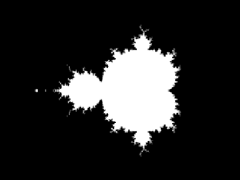

# Fractals
And it just keeps going

# About

This a remake of an old project I did as a student.
Looking back there is a heap of things that can be improved, and that is what I ammsetting out to do with this project.
Since we used a school library to code this project, it has to be rewritten using another library, in this case, I will use SDL.




Controls :

```
General :
    - Mouse Wheel: Zoom in / out
    - Mouse click: switch Color Mode
    - Enter      : Freeze fractal
    - Keys 1 - 4 : Switch fractal

Color Mode 0 -Gradient coloring- :
    - Left / right arrow : change color gradient

Color Mode 1 - Sine Coloring-    :
    - Left / Right arrow : Switch between R G B components;
    - UP/ Down arrow     : Change current value;
    - Space              : Switch between frequency, factor and start point;

```

